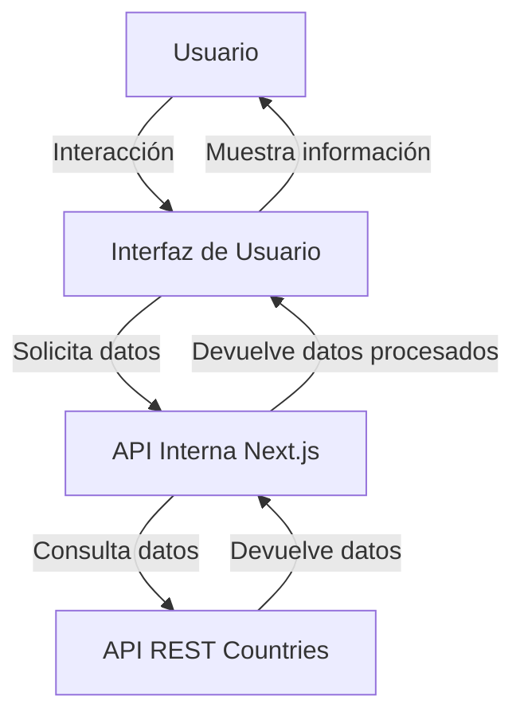

# Proyecto Next.js - Prueba Técnica

## Funcionalidades

Este proyecto incluye las siguientes funcionalidades principales:

1. **Listado de países**: Muestra una lista de países con información básica como nombre, región y población.
1. **Búsqueda de países**: Permite buscar un país específico por su nombre.
1. **Filtrado por región**: Filtra los países por región geográfica.
1. **Detalle de país**: Muestra información detallada de un país seleccionado, como su capital, idioma y moneda.
1. **Cambio de tema**: Permite alternar entre los temas claro y oscuro para mejorar la experiencia del usuario.

## Cómo ejecutar el proyecto

Sigue estos pasos para ejecutar el proyecto en tu entorno local:

1. Clona el repositorio:

```bash
 git clone <URL_DEL_REPOSITORIO>
```

1. Instala las dependencias:

```bash
npm install
# o
pnpm install
# o
yarn install
```

1. Inicia el servidor de desarrollo:

```bash
npm run dev
# o
pnpm dev
# o
yarn dev
```

1. Abre [http://localhost:3000](http://localhost:3000) en tu navegador para ver la aplicación.

## API utilizada

Se utilizó la API pública [REST Countries](https://restcountries.com/) para obtener información sobre los países. Las rutas principales implementadas en el proyecto son:

- **`GET /api/countries`**: Devuelve la lista de países.
- **`GET /api/countries/[name]`**: Devuelve los detalles de un país específico.

## Arquitectura y Solución

Este proyecto utiliza una arquitectura basada en **Next.js** para construir una aplicación web moderna y eficiente. A continuación, se describen los principales componentes y decisiones arquitectónicas:

### Estructura del Proyecto

- **`src/app`**: Contiene las páginas principales de la aplicación, incluyendo la página de inicio (`page.tsx`) y las rutas dinámicas para los detalles de los países.
- **`src/components`**: Incluye componentes reutilizables divididos en dos categorías:
  - **`common`**: Componentes genéricos como `card`, `filters`, y `navbar`.
  - **`ui`**: Componentes de interfaz de usuario como botones, menús desplegables y secciones destacadas.
- **`src/constants`**: Almacena datos de prueba y constantes globales.
- **`src/lib`**: Contiene utilidades y funciones auxiliares.
- **`src/types`**: Define los tipos TypeScript utilizados en el proyecto.
- **`src/app/api`**: Implementa rutas API para manejar datos, como la información de países.

### Generalidades de la Solución

1. **Framework**: Se utilizó **Next.js** por su capacidad de renderizado híbrido (SSR y SSG) y su integración con React.
2. **Estilos**: Se empleó **Tailwind CSS** para un diseño rápido y consistente.
3. **Pruebas**: Se implementaron pruebas unitarias con **Jest** y pruebas end-to-end con **Playwright** para garantizar la calidad del código.
4. **Temas**: Se incluyó un sistema de cambio de tema (claro/oscuro) utilizando un `ThemeProvider`.
5. **Optimización**: Se utilizó la librería `next/font` para optimizar las fuentes y mejorar el rendimiento.

Esta arquitectura permite una alta modularidad, escalabilidad y facilidad de mantenimiento.

## Diagrama de Arquitectura



Este diagrama muestra cómo el usuario interactúa con la interfaz de usuario, que a su vez solicita datos a la API interna de Next.js. Esta API interna consulta la API pública de REST Countries para obtener los datos necesarios y los devuelve a la interfaz de usuario.
